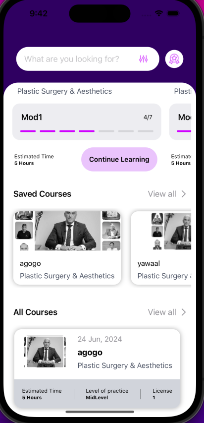

# MedSulto App

Medsulto unlocks access to the latest medical updates, globally & locally as provided by MOH, and advice from the medical community leaders to help physicians navigate their practice and elevate healthcare.

## Features I have worked on.

- Display Courses : Popular, Learning, Saved, and All.
- Search for courses tailored to their specific needs.
- Filter through a vast selection of medical courses.
- View Certificates for completed course.

## Built using / Technologies used:
* Swift.
* Swift UI.
* MVVM-C architectural pattern
* Combine
* SPM
* Async-Await

  
  
  
  
  
  
  
  
  
  
  
  
  
  
  

